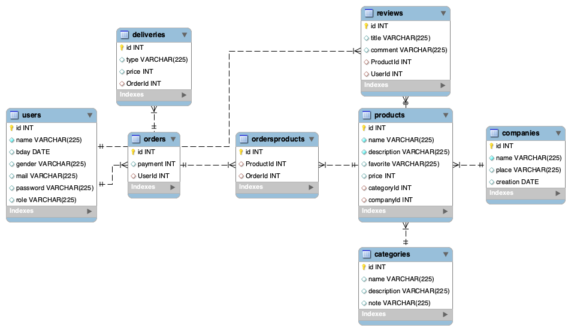

# BACKEND - Ejercicio

 <h3 align="center">1st BACKEND PROJECT</h3>

  

    Ejercicio realizado durante la séptima semana del bootcamp para poner en práctica toda la teoría explicada durante la semana anterior en las tecnologías node + express, además de mysql/sequelize. <a href="https://opentdb.com/">https://opentdb.com/</a>. Profesora Sofía Pinilla. El proyecto consiste en una estructura de tienda online(e-commerce) denominada <i>Candy</i>.

   
    <a href="https://github.com/pafz/quiz"><strong>Uso de node + express y mysql/sequelize</strong></a>
     
    ·
    <a href="https://github.com/pafz/quiz/issues">Report a Frontend Bug</a>
    ·
    <a href="https://github.com/pafz/bootstrap_Juanda_PatriciaF">Request a Frontend Feature</a>
    

<!-- TABLE OF CONTENTS -->

  
Contenido

  <ol>
        <li><a href="https://docs.google.com/document/d/15ssMgZOjryQKomx-hRipEEQIzh2pPAQ7_lTxPnkYrSk/edit" target="_blank">Objetivos</a></li>
    <li>
      <a href="#about-the-project">About The Project</a>
      <ul>
        <li><a href="#endpoints">Views</a></li>
         <li><a href="#built-with">Built With</a></li>
      </ul>   
    </li>
    <li><a href="https://docs.google.com/document/d/1qU3UZgZ3E9738ztX-6jTLlzx-SKPq7x5m2Ao5Uh8-xQ/edit" target="_blank">Cuestiones Bootstrap</a></li>
    <li><a href="#contributing">Contributing</a></li>
    <li><a href="#license">License</a></li>
    <li><a href="#acknowledgments">Acknowledgments</a></li>
    <li><a href="#contact">Contact</a></li>
  </ol>

<!-- ABOUT THE OBJECTIVES -->

## Objetivos

En este proyecto se repasa todo lo aprendido a lo largo de una semana sobre node + express y mysql/sequelize. Tras analizar las necesidades del proyecto, se espera el desarrollo de una API REST capaz de:
<objectives>

  <ol>
    <li>Registre usuarios usando Bcrypt</li>
    <li>Login de usuarios + token + middleware</li>
    <li>CRUD</li>
    <li>Relación N:M</li>
    <li>Relación 1:M</li>
    <li>Seeders</li>
</ol>
</objectives>

<!-- ABOUT THE PROJECT -->

## Sobre el proyecto

En este proyecto implementa Sequelize ENUMERAR RESTO DE LOS TEMAS <i>Bienvenidaen</i> en la que se visualiza la grafíca del histórico de puntos y se muestra el botón para comenzar el juego. l

Cada pregunta con sus cuatro respuestas se muentran de forma individual. A través de un botón se selecciona una única opción y justo despúes todos los botones de respuestas serán bloqueados. Durante 1 segundo a través de un <i>setTimeOut</i> se visualizará en color verde el texto del botón en caso de ser correcta, o por el contrario en color rojo en caso de ser incorrecta. Después de ese 1 segundo pasa a la siguiente pregunta de forma automática hasta llegar a la última pregunta.

Una vez finalizadas las preguntas se mostrará el resultado de ese Quiz recién realizado junto con dos botones que realizarán la función de navegador para acceder a la vista <i>Home</i> o para <i>Reempezar</i> el juego.

### Views

<views>
      <ol>
        <li>
          <strong>Product</strong>
          <ul>
            CRUD productos
            <li>Endpoint para crear un producto - solo admin</li>
            <li>Endpoint para actualizar un producto - solo admin</li>
            <li>Endpoint para eliminar un producto - solo admin</li>
            <li>Endpoint para traer todos productos y que muestre los productos junto a sus categorías y sus reviews</li>
          </ul>
          <ul style="list-style-type:square">
            <li>Endpoint que traiga un producto por su id y que muestre los productos junto a sus categorías y sus reviews</li>
            <li>Filtro para buscar producto por nombre</li>
            <li>Filtro para buscar producto por precio</li>
            <li>Filtro que ordene los productos de mayor a menor precio</li>
            <li><strong>Validación:</strong> Implementa validación a la hora de crear un producto para que se rellene todos los campos y si no se hace que devuelva un mensaje</li>
            <li><strong>Autentificado:</strong> Solo podrás crear, actualizar y eliminar productos si estás autenticado.</li>
        </ul>
        </li>
        <li>
          <strong>Category</strong>
          <ul>
            CRUD categorías
            <li>Endpoint para crear un categoría</li>
            <li>Endpoint para actualizar un categoría</li>
            <li>Endpoint para eliminar un categoría</li>
            <li>Endpoint para ver todas las categorías junto a los productos que tienen</li>
          </ul>
          <ul style="list-style-type:square">
            <li>Crea un endpoint que devuelva una categoría por id</li>
            <li>Filtro para buscar categoría por nombre</li>
         </ul>
         </li>
         <li>
         <strong>Order</strong>
          <ul style="list-style-type:square">
              <li>Crea un endpoint para ver los pedidos junto a los productos que tienen</li>
              <li>Crea un endpoint para crear pedidos</li>
          </ul>
         </li>
         <li>
         <strong>User</strong>
         <ul tyle="list-style-type:square">
            <li>Endpoint para registrar un usuario utilizando <strong>bcrypt</strong></li>
            <li>Endpoint para login(utilizando <strong>bcrypt +JWT</strong>)</li>
            <li>Endpoint que nos traiga la información del usuario conectado junto a los pedidos que tiene y los productos que contiene cada pedido</li>
            <li>Endpoint para el logout</li>
            <li><strong>Validación.</strong> Implementa validación a la hora de crear un usuario para que se rellene todos los campos y si no se hace que devuelva un mensaje</li>
            <li><strong>Mail.</strong> Tras registrarse recibe un mail de confirmación para su registro</li>
          </ul>
         </li>
          <li>
          <strong>Reviews</strong>
          <ul>
            CRUD opiniones
            <li>Endpoint para crear un review</li>
            <li>Endpoint para actualizar un review</li>
            <li>Endpoint para eliminar un review</li>
            <li>El endpoint de traer reviews debe mostrarlas junto al usuario UserId que hizo esa review</li>
          </ul>
         </li>
         <li>
         <strong>Seeders</strong>
         <ul tyle="list-style-type:square">
            <li>Crea 5 productos con un seeder</li>
          </ul>
         </li>

</views>

(<a href="README.md#top">volver al principio </a>)

<!-- FUTURE -->

## Future Roadmap

- [ ] Multer <a href="https://github.com/expressjs/multer/blob/master/doc/README-es.md" target="_blank">info</a> & <a href="https://www.webslesson.info/2022/05/upload-file-in-node-js-express-using-multer.html" target="_blank">HOW TO</a>
- [ ] Frontend
- [ ] More validations <a href="https://sequelize.org/docs/v6/core-concepts/validations-and-constraints/" target="_blank">Sequelize Validations & Constraints</a>
- [ ] More associations <a href="https://sequelize.org/docs/v6/core-concepts/assocs/" target="_blank">Sequelize Associations</a>

(<a href="README.md#top">volver al principio </a>)

<!-- LICENSE -->

## License

Este proyecto ha sido realizado como trabajo de aprendizaje por Patricia Fernández.

(<a href="README.md#top">volver al principio </a>)

<!-- PREVIEW -->

## Preview

- General overview

<!-- CONTACT -->

## Contact

  

Patricia Fernández

(<a href="README.md#top">volver al principio </a>)

